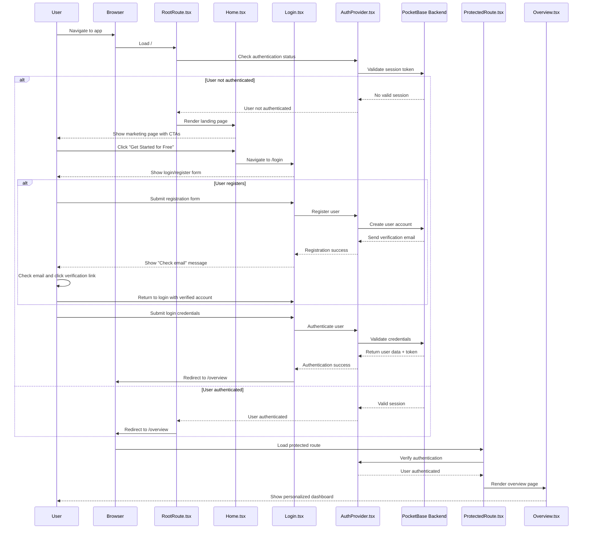

# Authentication Flow

This diagram shows how users authenticate and gain access to the Organized Glitter app.

## Key Files Involved

- `src/components/auth/RootRoute.tsx` - Main app entry point and auth routing
- `src/components/auth/ProtectedRoute.tsx` - Wrapper for authenticated routes
- `src/contexts/AuthContext/AuthProvider.tsx` - Authentication state management
- `src/pages/Home.tsx` - Landing page for unauthenticated users
- `src/pages/Login.tsx` - Login and registration forms
- `src/pages/Overview.tsx` - Primary dashboard after login