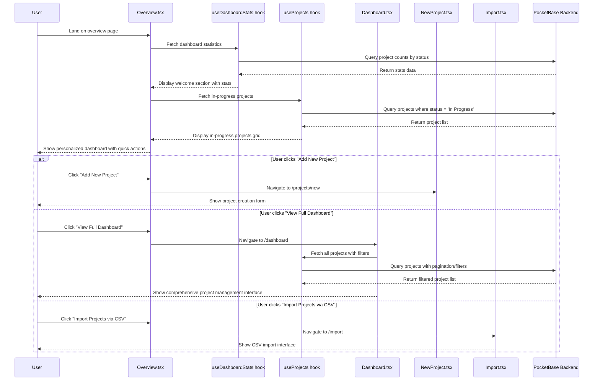

# Main Dashboard Experience Flow

This diagram shows how users navigate the main dashboard and overview pages.

## Key Files Involved

- `src/pages/Overview.tsx` - Primary dashboard after login
- `src/pages/Dashboard.tsx` - Full project management interface
- `src/hooks/queries/useDashboardStats.ts` - Dashboard statistics
- `src/hooks/queries/useProjects.ts` - Project list queries
- `src/pages/NewProject.tsx` - Project creation form
- `src/pages/Import.tsx` - CSV import interface
