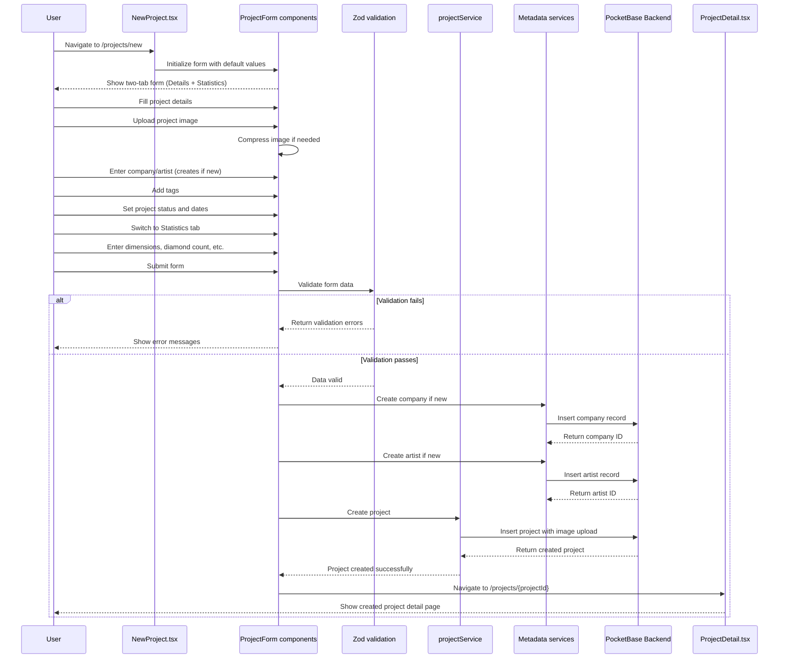

# Project Creation Flow

This diagram shows the complete project creation process with validation and metadata handling.

## Key Files Involved

- `src/pages/NewProject.tsx` - Project creation form
- `src/components/projects/ProjectForm/` - Modular project form components
- `src/schemas/projectSchema.ts` - Zod validation schemas
- `src/services/pocketbase/projectService.ts` - Project data operations
- `src/services/pocketbase/companyService.ts` - Company metadata service
- `src/services/pocketbase/artistService.ts` - Artist metadata service
- `src/pages/ProjectDetail.tsx` - Individual project view
- `src/utils/imageCompression.ts` - Image processing utilities
