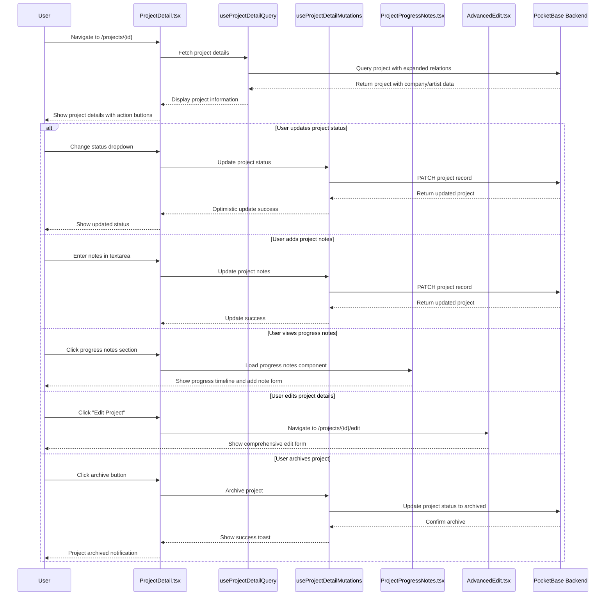

# Project Management Flow

This diagram shows how users view and manage individual projects.

## Key Files Involved

- `src/pages/ProjectDetail.tsx` - Individual project view and management
- `src/hooks/queries/useProjectDetailQuery.ts` - Project detail queries
- `src/hooks/mutations/useProjectDetailMutations.ts` - Project update operations
- `src/components/projects/ProjectProgressNotes.tsx` - Progress notes interface
- `src/pages/AdvancedEdit.tsx` - Comprehensive project editing
- `src/components/ui/toast.tsx` - Toast notification system