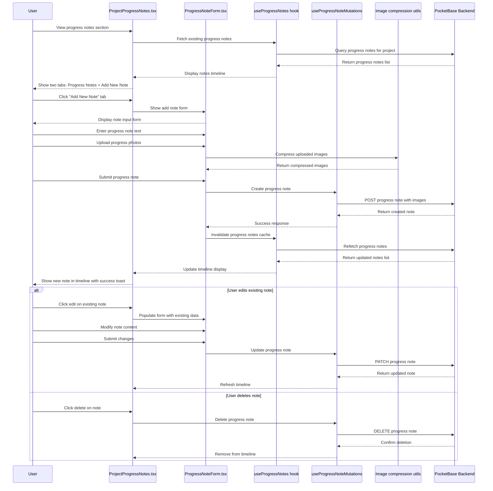

# Progress Tracking Flow

This diagram shows how users add and manage progress notes with photos for their projects.

## Key Files Involved

- `src/components/projects/ProjectProgressNotes.tsx` - Progress notes interface
- `src/components/projects/ProgressNoteForm/` - Modular progress note form
- `src/hooks/queries/useProgressNotes.ts` - Progress notes queries
- `src/hooks/mutations/useProgressNoteMutations.ts` - Progress note operations
- `src/utils/imageCompression.ts` - Image processing utilities
- `src/services/pocketbase/progressNotesService.ts` - Progress tracking operations
