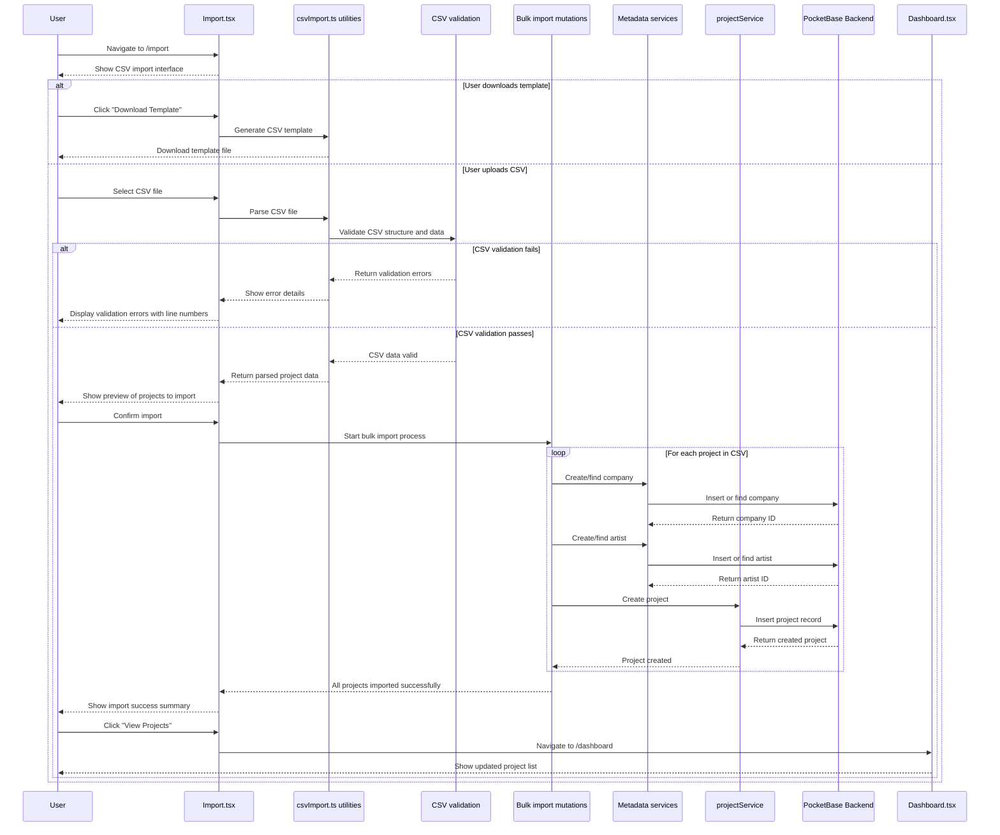

# Data Management/CSV Import Flow

This diagram shows how users can bulk import projects via CSV files.

## Key Files Involved

- `src/pages/Import.tsx` - CSV import interface
- `src/utils/csvImport.ts` - CSV parsing and validation utilities
- `src/utils/csvExport.ts` - CSV template generation
- `src/hooks/mutations/useBulkImportMutations.ts` - Bulk import operations
- `src/services/pocketbase/projectService.ts` - Project data operations
- `src/services/pocketbase/companyService.ts` - Company metadata service
- `src/services/pocketbase/artistService.ts` - Artist metadata service
- `src/pages/Dashboard.tsx` - Full project management interface